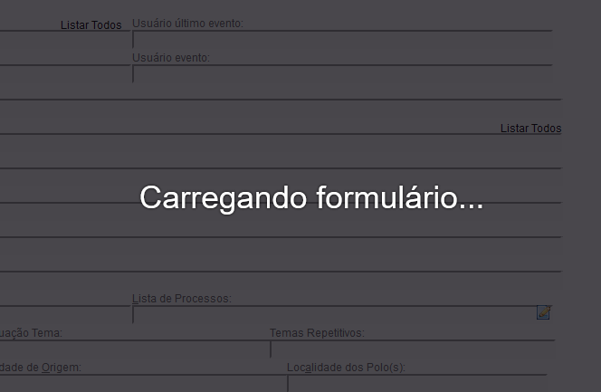

O formulário da página "Relatório Geral" demora um bom tempo para carregar, e
algumas opções não estão disponíveis até que a página seja completamente carregada.

Ao abrir a página "Relatório Geral", aparecerá a seguinte tela:

<figure>
	
	<figcaption>Tela do eproc indicando ao usuário que aguarde o carregamento do formulário</figcaption>
</figure>

Quando o formulário estiver totalmente carregado, a tela irá desaparecer, permitindo ao usuário que faça as alterações necessárias.
