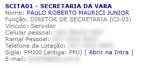

Adiciona um link no <a href="https://serh.trf4.jus.br/achei/pesquisar.php" target="_blank" class="link-new-window">Achei!</a> para acessar as informações da pessoa na Intra:

<figure>
	
	<figcaption>Informações da pessoa no Achei!</figcaption>
</figure>
