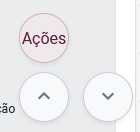

Na tela do processo, é criado um botão para retornar rapidamente ao menu "Ações", independente da posição atual de rolagem da página:

<figure>
	
	<figcaption>Botão criado pelo script</figcaption>
</figure>
