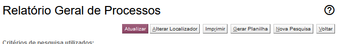

Na tela de relatório geral, ao abrir os resultados da pesquisa, muitas vezes são movimentados alguns processos, e se deseja atualizar a lista para que não apareçam mais os que foram movimentados (e deixaram de atender aos critérios de pesquisa).

Este script acrescenta um botão que permite atualizar os resultados, utilizando os mesmos critérios:

<figure>
	
	<figcaption>Botão para atualizar os resultados do relatório geral</figcaption>
</figure>
