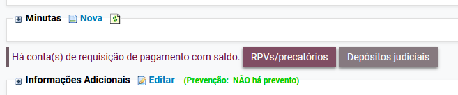
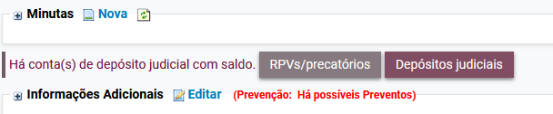
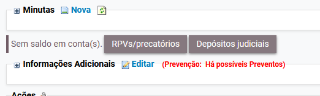
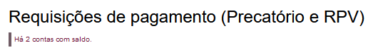
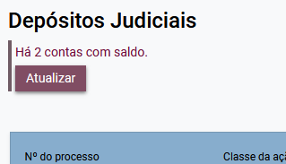
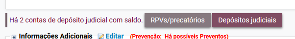

### Tela do processo

Na tela do processo, é exibida informação sobre contas de requisições de pagamento ou depósitos judiciais com saldo.

RPVs e precatórios:

<figure>
	
	<figcaption>Informação acerca da existência de valores depositados em razão de requisição de pagamento (RPV ou precatório)</figcaption>
</figure>

Depósitos judiciais:

<figure>
	
	<figcaption>Informação acerca da existência de depósito judicial</figcaption>
</figure>

Nenhuma conta com saldo:

<figure>
	
	<figcaption>Informação acerca da inexistência de contas com saldo</figcaption>
</figure>

### Detalhamento das contas

Ao clicar sobre o botão correspondente às contas de RPV e precatório, é aberta nova aba com a informação das contas:

<figure>
	
	<figcaption>Informações sobre contas de RPVs e precatórios com saldo</figcaption>
</figure>

**Observação:** o saldo das contas de RPVs e precatórios da Caixa Econômica Federal é atualizado automaticamente.

Ao clicar sobre o botão correspondente às contas de depósitos judiciais, é aberta nova aba com a informação das contas. Um botão permite atualizar o saldo das contas:

<figure>
	
	<figcaption>Informações sobre contas judiciais com saldo</figcaption>
</figure>

### Atualização dos dados

Após o acesso à tela de detalhamento das contas, havendo ou não atualização dos saldos, a informação sobre a quantidade de contas com saldo, na tela do processo, estará atualizada.

<figure>
	
	<figcaption>Informações atualizadas</figcaption>
</figure>
