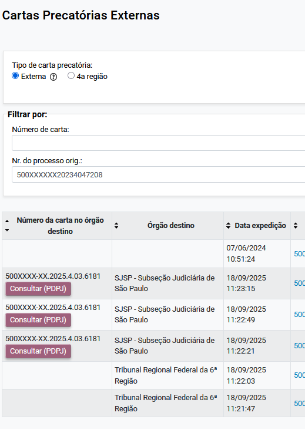

### Tela “Cartas Precatórias Externas” ###

Na tela “Cartas Precatórias Externas”, para cada carta precatória com número no órgão de destino informado, é exibido um botão que permite consultá-la diretamente no [Portal _jus.br_](https://www.jus.br):

<figure>
	
	<figcaption>Botões para consulta das cartas precatórias</figcaption>
</figure>

Ao clicar sobre o botão, será aberta em outra aba a consulta no Portal _jus.br_.