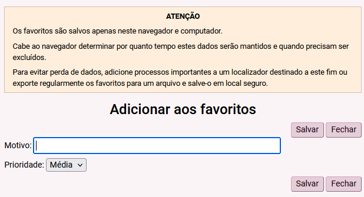

### ATENÇÃO ###

#### Favoritos ####

Os favoritos não são salvos na “nuvem”, apenas localmente, e podem ser excluídos
pelo navegador (Chrome, Firefox) em caso de espaço insuficiente.

Processos importantes devem ser adicionados a um localizador destinado a este
fim.

#### Histórico ####

Serão salvos apenas os processos acessados após a instalação do _script_. O
histórico não inclui processos acessados em outro navegador ou computador.

Para obter a relação completa de processos acessados por um usuário, solicite a
alguém com perfil de Diretor de Secretaria.

### Tela do processo ###

Na tela do processo, ao lado de seu número, é criado um ícone para incluí-lo
na lista de favoritos:

<figure>
	
	<figcaption>Ícone criado pelo script</figcaption>
</figure>

Ao clicar sobre o ícone, aparecerá outra tela onde pode ser preenchido o motivo
da inclusão e a prioridade do processo na lista de favoritos (alta, média ou
baixa):

<figure>
	
	<figcaption>Tela de preenchimento dos detalhes do favorito</figcaption>
</figure>

Clicando no mesmo ícone, em um processo já incluído nos favoritos, a mesma tela
permitirá a alteração dos dados e sua exclusão.

### Barra superior ###

Na barra superior do eproc são criados dois ícones: “Histórico de processos” e
“Favoritos”, para acesso às respectivas listas:

<figure>
	
	<figcaption>Ícones na barra superior</figcaption>
</figure>

Ao abrir a lista de favoritos, é possível exportá-la para um arquivo, para
armazenamento em local seguro ou transferência para outro computador, através da
opção de importação.