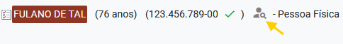
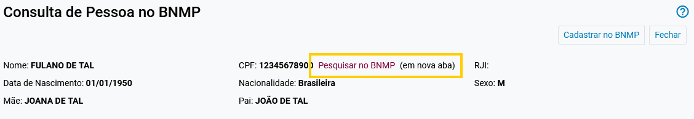

No _eproc_, clicar no botão de pesquisa sobre a situação da pessoa no BNMP:

<figure>
	
	<figcaption>Botão de pesquisa sobre a situação da pessoa no BNMP</figcaption>
</figure>

Na tela de consulta, aparecerá(ão) link(s) ao lado do CPF e/ou RJI, para abrir a pesquisa em nova aba, diretamente no sistema BNMP:

<figure>
	
	<figcaption>Link gerado</figcaption>
</figure>
