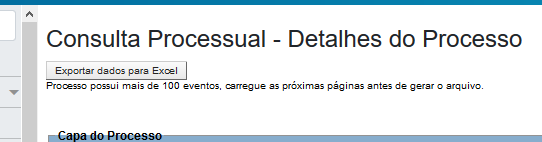

Ao carregar a tela do processo, aparecerá o seguinte botão e, se necessário, o aviso:

<figure>
	
	<figcaption>Botão criado pelo script e aviso quando há mais de 100 eventos</figcaption>
</figure>

Após clicar no botão, o script irá buscar os seguintes dados do processo e exportá-los para uma planilha no formato XLSX (Excel 2007):

- Número do processo;
- Número do processo sem pontuação;
- Valor da causa;
- Data da sentença;
- Autores;
- Réus e respectiva data de citação.
