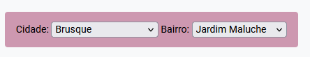

No menu &ldquo;Execução Penal&rdquo;, opção &ldquo;Gerenciar Entidades Assistenciais&rdquo; é exibido o seguinte filtro, para exibir apenas as entidades de determinada cidade ou bairro:

<figure>
	
	<figcaption>Filtro criado pelo script</figcaption>
</figure>
