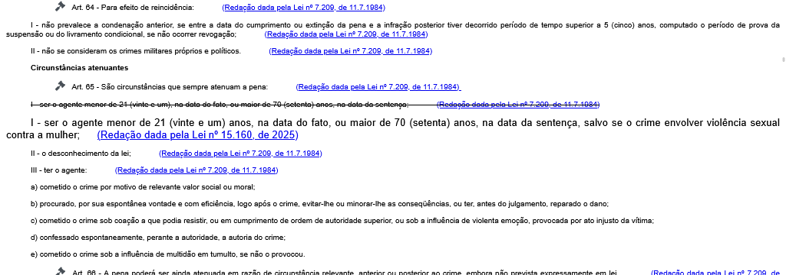
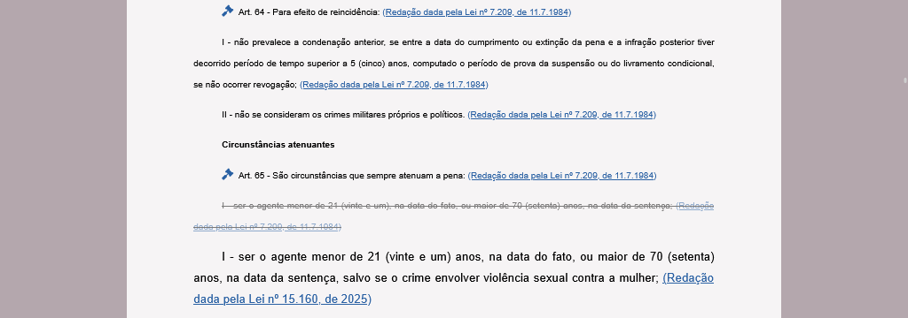

Melhora a legibilidade da legislação disponível no site do Planalto, limitando a largura do texto e usando cores mais suaves.

Altera também a aparência de <a href="https://www.trf4.jus.br/trf4/controlador.php?acao=ato_normativo_pesquisar" target="_blank">atos normativos do Tribunal Regional Federal da 4ª Região</a>.

## Exemplo

<a href="https://www.planalto.gov.br/CCIVIL_03/Decreto-Lei/Del2848.htm" target="_blank">Código Penal</a>

Sem o _script_:

<figure>
	
	<figcaption>Aparência original do Código Penal</figcaption>
</figure>

Com o _script_:

<figure>
	
	<figcaption>Aparência do Código Penal com script instalado</figcaption>
</figure>
