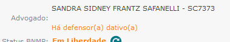

Ao abrir um processo no SEEU, adiciona informação à capa do processo caso haja advogado(a)(s) dativo(a)(s):

<figure>
	
	<figcaption>Informação de existência de defensor(a) dativo(a)</figcaption>
</figure>
