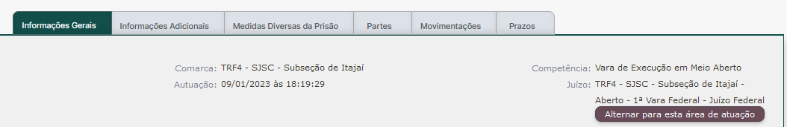

Este script permite alterar a área de atuação no SEEU a partir da aba "Informações Gerais" de um processo:

<figure>
	
	<figcaption>Botão para alterar área de atuação</figcaption>
</figure>

É útil em situações em que algum(a) colega informa um número de processo, mas este é de uma área de atuação diversa da que se está trabalhando atualmente.

Caso o(a) usuário(a) não possua perfil na área de atuação do processo, será apresentada uma mensagem de erro após clicar no botão.

Quando o processo for da mesma área de atuação selecionada pelo(a) usuário(a), o botão não será exibido.
