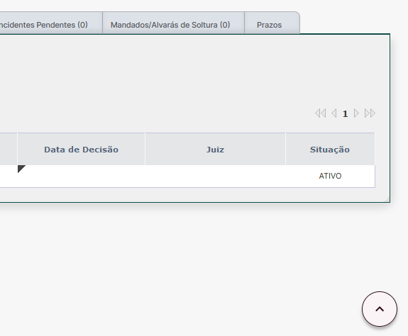

Adiciona um botão no canto inferior direito da tela, que ao ser clicado retorna rapidamente ao topo da página, dispensando a utilização da roda do mouse:

<figure>
	
	<figcaption>Botão "Ir para o topo"</figcaption>
</figure>
