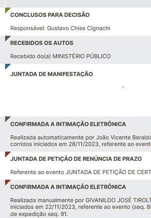
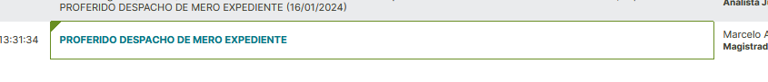
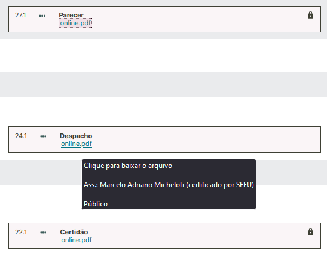
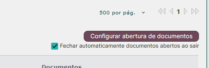
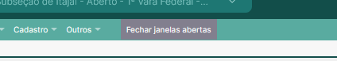

Este script adiciona algumas funcionalidades que facilitam a abertura de documentos na tela "Movimentações".

Os botões para carregar os documentos de cada sequencial são pressionados automaticamente, à medida em que a página é rolada:

<figure>
	
	<figcaption>Botões de carregamento de documentos pressionados automaticamente</figcaption>
</figure>

É acrescentada uma informação visual em cada sequencial, cuja cor reflete o tipo de "parte" responsável pela movimentação:

- <strong style="color: #698e23;">Verde</strong>: Juízes(as) e servidores(as);
- <strong style="color: #236e8e;">Azul</strong>: Ministério Público;
- <strong style="color: #8e3523;">Vermelho</strong>: advogado(a);
- <strong style="color: #595959;">Cinza</strong>: outros.

<figure>
	
	<figcaption>Informação visual quanto ao(à) responsável pela movimentação</figcaption>
</figure>

Destaque para movimentações realizadas por magistrados(as):

<figure>
	
	<figcaption>Movimentação realizada por magistrado</figcaption>
</figure>

Alteração da forma de apresentação dos documentos juntados, para facilitar a rápida identificação de seu conteúdo:

<figure>
	
	<figcaption>Forma de apresentação dos documentos juntados</figcaption>
</figure>

Permite a abertura de documentos em janelas separadas, na posição em que o usuário configurar.

As janelas podem ser fechadas automaticamente ao sair da tela de movimentação:

<figure>
	
	<figcaption>Botão para configurar a forma de abertura de documentos</figcaption>
</figure>

Permite fechar todas as janelas de documentos abertas, manualmente:

<figure>
	
	<figcaption>Botão para fechar todas as janelas de documentos</figcaption>
</figure>
