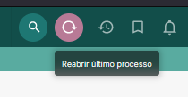

Este script adiciona um botão à barra superior do SEEU, que permite acessar facilmente o último processo aberto:

<figure>
	
	<figcaption>Botões para reabrir o último processo</figcaption>
</figure>

O script detecta o último processo acessado com base no histórico, que está disponível a todos os usuários através de ícone localizado na mesma barra.

**Observação**: Após a instalação deste script, é necessário fazer novo login no SEEU para que o botão seja exibido.
