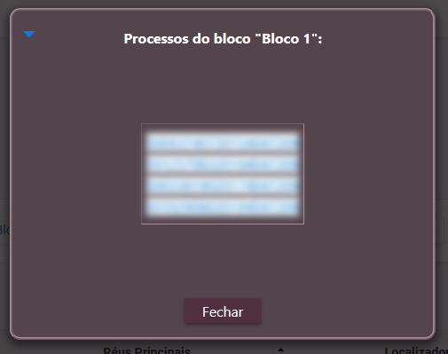

Na lista de processos por localizador, aparecerá uma seção permitindo gerenciar blocos:

<figure>
	
	<figcaption>Seção de gerenciamento de blocos</figcaption>
</figure>

Clicando-se no botão "Criar bloco", é possível criar novos blocos vazios.

<figure>
	
	<figcaption>Blocos sem processos</figcaption>
</figure>

Ao abrir qualquer processo, são exibidos os blocos já criados. Pode-se incluir um processo em um bloco existente, marcando-se a opção correspondente, ou usar o ícone "Inserir processo no bloco e fechar a janela", para encerrar a análise do processo de forma mais ágil.

<figure>
	
	<figcaption>Blocos do processo</figcaption>
</figure>

Após a inserção de alguns processos nos blocos, a informação será atualizada na lista de processos por localizador:

<figure>
	
	<figcaption>Blocos com processos</figcaption>
</figure>

- Usando o marcador de seleção (1) é possível selecionar, na listagem de processos, todos aqueles que estão incluídos no bloco correspondente (ou processos sem bloco), para movimentação através do menu "Ações", por exemplo, criar minutas em lote ou realizar intimação em bloco.
- Após o nome de cada bloco, é mostrada a quantidade de processos **visíveis na tela atual**, bem como a quantidade total de processos no bloco (2).
- Através dos ícones (3), é possível:
  - Renomear um bloco;
  - Excluir um bloco;
  - Remover do bloco os processos ausentes (não visíveis na página atual).
- Ao clicar na quantidade de processos do bloco (2), são exibidos os números de todos os processos nele incluídos, prontos para copiar (<kbd>Ctrl</kbd> + <kbd>C</kbd>):

<figure>
	
	<figcaption>Processos de um bloco</figcaption>
</figure>
