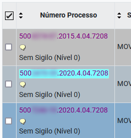

Estende a funcionalidade de destaque do último link clicado para outras telas do eproc, não apenas documentos do processo:

<figure>
	
	<figcaption>Destaque para o último link clicado</figcaption>
</figure>
