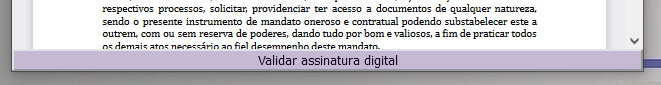
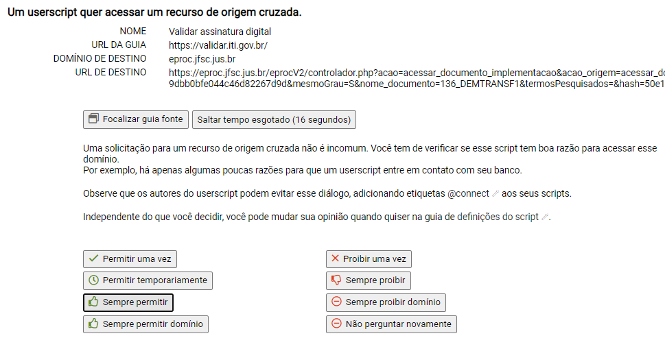

Ao abrir um documento PDF no eproc, aparecerá o seguinte botão na parte inferior da respectiva aba ou janela:

<figure>
	
	<figcaption>Botão na parte inferior da janela do documento PDF</figcaption>
</figure>

Ao clicar no botão, será aberta em uma nova aba o site <a href="https://validar.iti.gov.br" target="_blank">https://validar.iti.gov.br</a>. O documento PDF correspondente será enviado automaticamente para validação através do site, basta aguardar o carregamento para ver o resultado.

## Solução de erros

Caso apareça a mensagem abaixo ao tentar validar um documento, selecione a opção &ldquo;Sempre permitir&rdquo;:

<figure>
	
	<figcaption>Mensagem avisando sobre acesso a documentos do <em>eproc</em></figcaption>
</figure>
